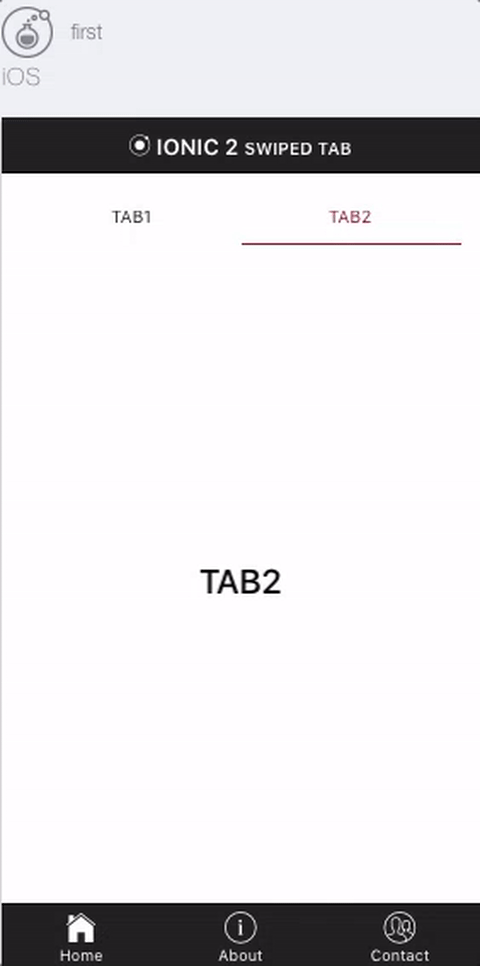
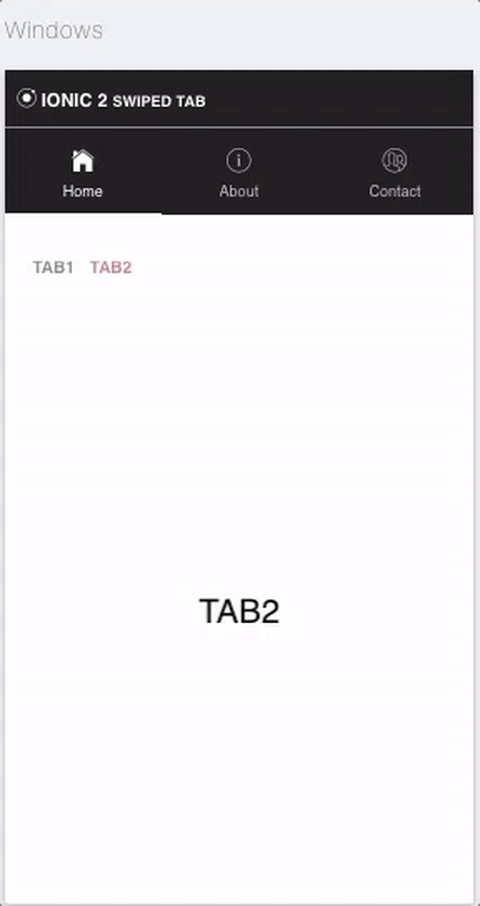

# a simple example using swiped tabs (2 tabs) IONIC 2

[Youtube Link](https://www.youtube.com/watch?v=dJTFt0aeRUo&feature=youtu.be) 
android 
 
ios 
 
windows 
 
#Need Custom Work? 
If you need help with your Ionic apps, if you need a specific plugin or integration. Let's get in touch. I'll be glad to develop or advise you for your app! Email me at karraysoufien@gmail.com.
